# Înscriere la licență ASE-CSIE

Aplicația este menită să faciliteze o posibilă colaborare pentru elaborarea lucrării de licență, între studenții din an terminal a unei facultăți și profesorii coordonatori. 

Se poate regăsi live la adresa: https://als.csie.ase.ro, accesibilă doar prin cont instituțional ase.

<b><i>Disclaimer: Codul este exclus din acest repository, din motive de siguranță și confidențialitate.</i></b>

Funcționalitățile pe care aplicația dezvoltată de echipa din care am făcut parte sunt bine-definite și 
conform cerințelor solicitate, datorită întâlnirilor frecvente susținute alături de profesorii noștri 
coordonatori, dar și de șeful de departament D.I.C.E și alți domni profesori care ne-au ajutat în acest 
demers. Astfel, acestea sunt următoarele:
<ul>

<li>Toți utilizatorii (studenți, profesori) se autentifică prin intermediul contului google instituțional, 
oferit de universitate. </li>
<li>Administratorul – director de departament – utilizează un cont special de tip no-reply pentru autentificare, interfața sa fiind diferită.
</li>
<li>Atât studenții, cât și profesorii își introduc detaliile personale necesare în vederea înscrierii la licență, precum grupă, telefon, an înmatriculare, an de studiu, formă de învățământ și specializare pentru cei dintâi, respectiv grad didactic și specializare pentru profesori.
</li>
<li>Inițial, cei înrolați drept profesori au limita maximă admisă de locuri pentru studenți ca fiind nulă. Ulterior, administratorul le confirmă identitatea și posibilitatea de a coordona studenți pentru licență prin modificarea limitei la 15 studenți (sau un alt număr la decizia acestuia).
</li>
<li>Studentul vizualizează profesorii disponibili, aceștia fiind cei din cadrul specializării sale și care mai dețin locuri disponibile. El va putea să inițieze o solicitare de colaborare unuia dintre aceștia, adăugând într-un formular tema generală sau titlul licenței, alături de un mesaj pentru profesor. La trimiterea solicitării, profesorul este notificat printr-un email primit de la contul de no-reply aferent adminului.
</li>
<li>În primele două zile de la trimiterea unei solicitări, platforma nu permite inițierea alteia din partea studentului până acesta nu este refuzat, pentru a preveni situația în care studentul este acceptat de mai mulți profesori. După această limită temporală, el poate retrage solicitarea sau aștepta în continuare.
</li>
<li>În cadrul contului său, profesorul poate vizualiza studenții deja acceptați, numărul de locuri maxime disponibile, numărul de locuri deja ocupate, lista de solicitări în așteptare, dar și cererile pentru semnat sau deja semnate.
</li>
<li>Profesorul are posibilitatea de a decide dacă acceptă sau refuză un student, vizualizându-i informațiile personale și instituționale, titlul sau tematica dorită pentru licență și mesajul transmis. Decizia sa va fi trimisă și pe e-mail studentului, pentru ca acesta să fie înștiințat.
</li>
<li>În cazul uni răspuns negativ, studentul va trebui să solicite alt profesor din tabelul afișat, repetând procesul până când va fi acceptat. În cazul în care viitorul absolvent nu își va găsi un coordonator, administratorul îi va atribui manual un profesor. Ca acest fapt să fie posibil, el poate mări limita maximă admisă de studenți a unui profesor, dacă este necesar.
</li>
<li>Odată asociat unui profesor, platforma va permite generarea cererii de licență în mod automat, precompletată pe baza detaliilor furnizate de către student în contul său și ale profesorului coordonator. După semnarea documentului, studentul îl încarcă în spațiul special alocat și așteaptă semnătura cadrului didactic.
</li>
<li>În urma pasului anterior, coordonatorul va fi notificat pe e-mail că a primit o nouă cerere de semnat, fiind necesar ca acesta să intre în aplicație, să descarce, semneze și reîncarce pdf-ul primit. În cazul în care, din diverse motive (greșeli gramaticale sau de ortografie, neconcordanța titlului cererii cu cel transmis prin solicitare, etc.), profesorul poate refuza cererea, transmițând studentului și un e-mail cu motivul refuzului, direct din cadrul platformei. Astfel, fluxul documentului se va repeta, până când va fi acceptată și semnată cererea de către ambele părți.
</li>
<li>Cererea finală este vizibilă și poate fi descărcată de către student chiar din contul său, putând să o transmită mai departe către decanat.
</li>
<li>Platforma permite ca studentul să își schimbe titlul de licență deja aprobat în prealabil, prin trimiterea unei noi cereri. Întocmai ca și anterior, cererea poate fi atât admisă, cât și respinsă. Cu toate acestea, întotdeauna ultima cerere aprobată va fi cea finală.
</li>
<li>De asemenea, rolul de administrator deține drepturi depline de vizualizare, adăugare, modificare și ștergere date, cât și de generare rapoarte din pagina destinată acestuia.
</li>
</ul>

<h2>Screenshots din interfață:</h2>
Prima pagină vizualizată:
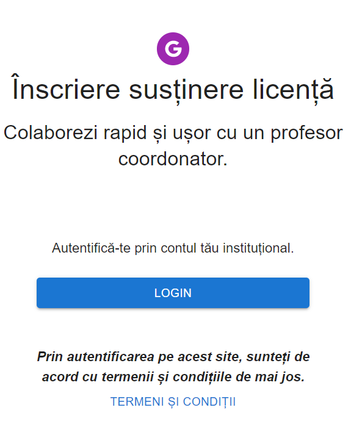

Pentru autentificarea din contul instituțional:
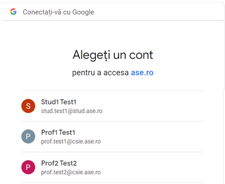

<h3>Pagină student</h3>

Este necesar ca studentul să își completeze datele sale,
pentru a putea vizualiza profesorii din cadrul specializării sale.
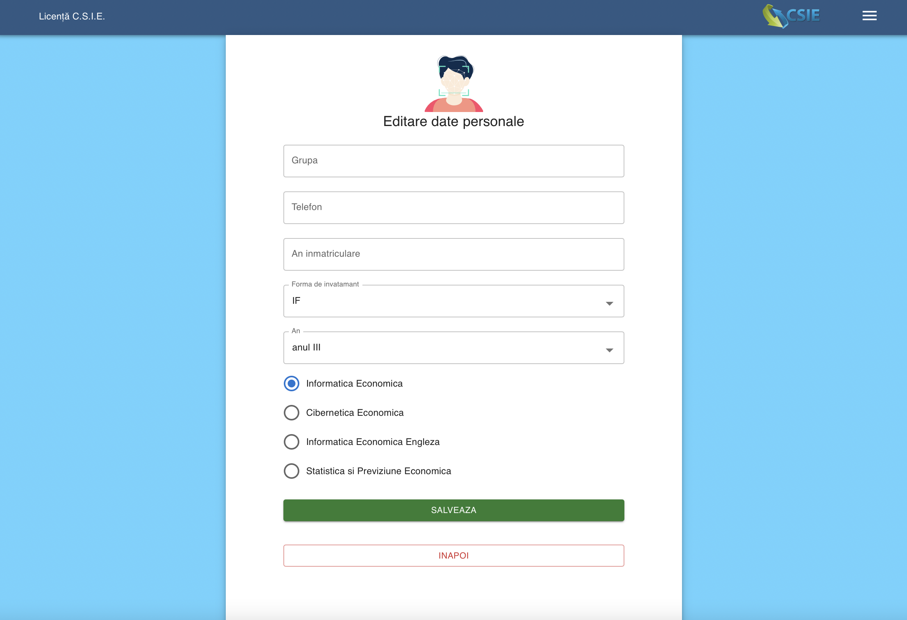

Tabelul cu profesori
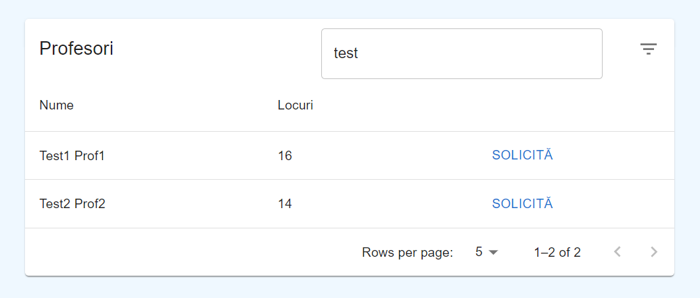

La click pe solicită, se afișează:
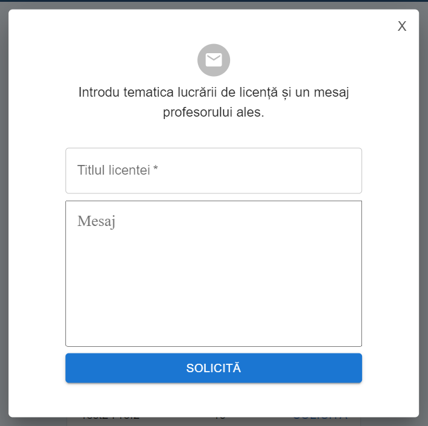

Apoi, studentul așteaptă un răspuns: fie i se resinge cererea și va trimite una nouă
unui alt profesor, fie va fi acceptat iar pagina sa va arăta astfel:

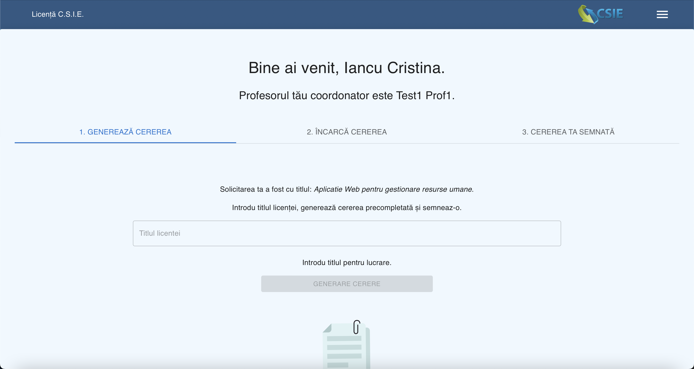

Primul tab îi permite studentului să își genereze cererea precompletată
cu datele sale și ale profesorului coordonator. 

Al doilea tab este destinat încărcat cererii completate și semnate de către student,
pentru a fi semnată și de profesor.

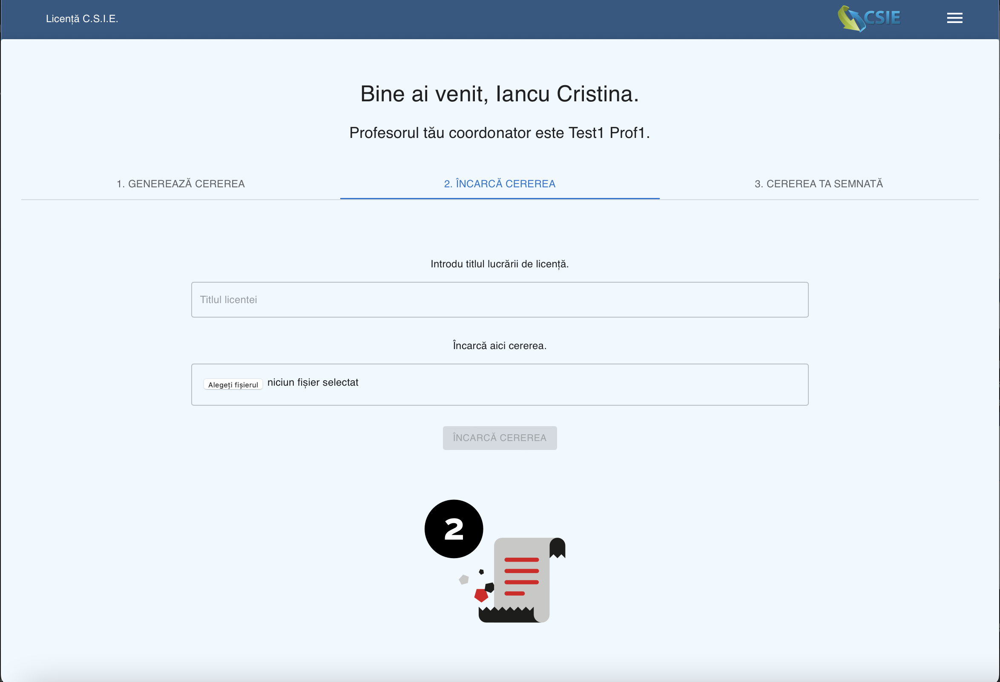

De asemenea, există și o pagină de ajutor, cu informații utile:

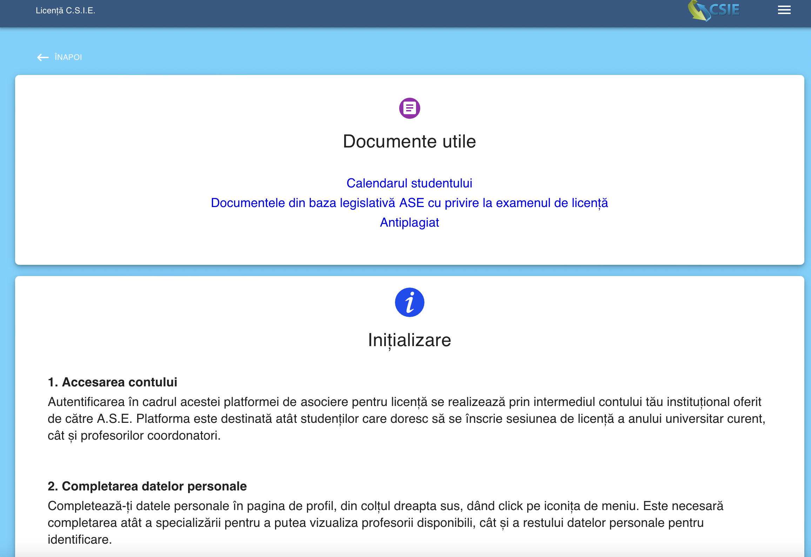

Acum, intervine profesorul. Acesta primește e-mail pentru fiecare solicitare
primită de la un student.

<h3>Pagină profesor</h3>

Odată autentificat, dacă este prima dată, profesorul își va completa datele:
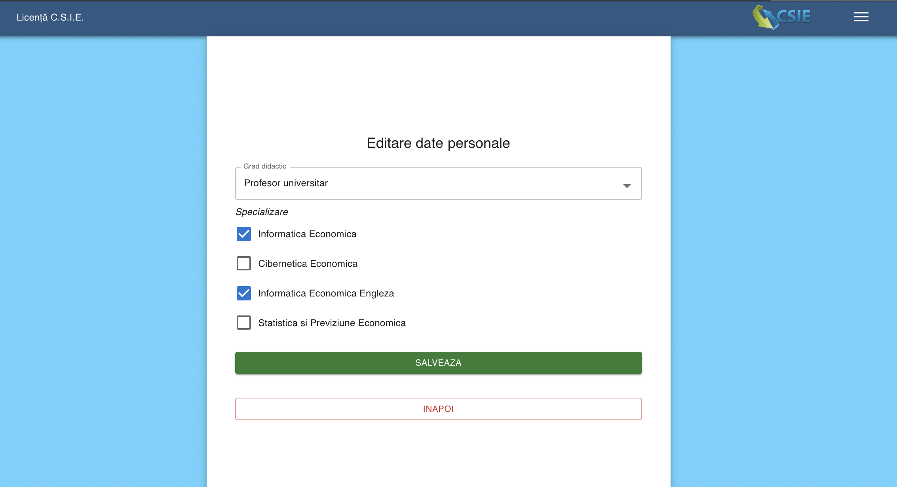

O nouă solicitare va apărea în cadrul primului tab, astfel:
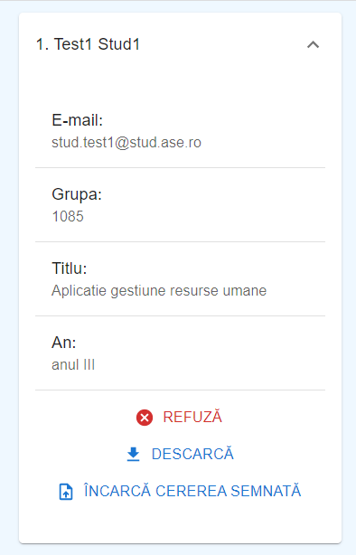

Toți studenții se află în tabul 2:
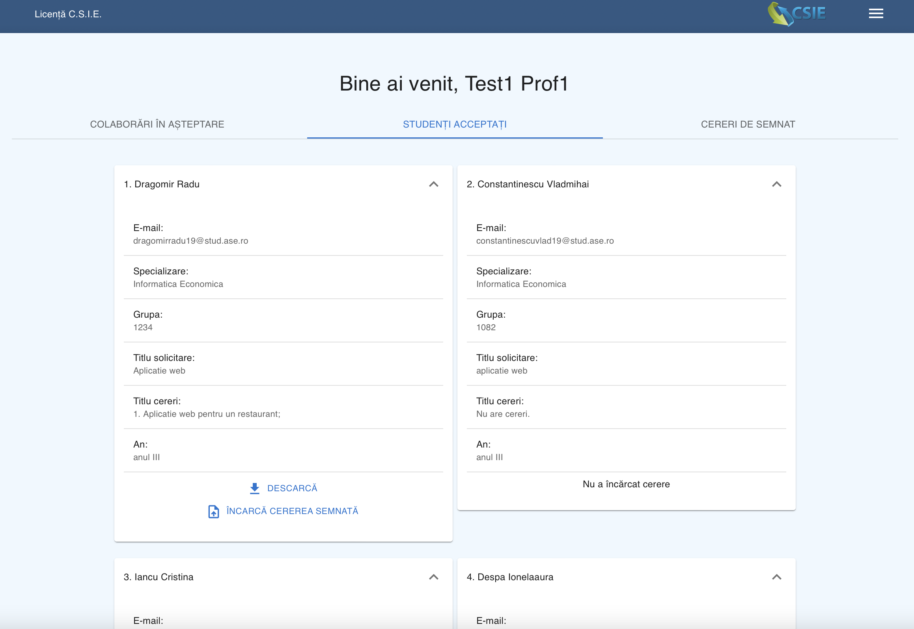

Cel de-al treilea tab afișează doar studenții care au cereri ce așteaptă
să fie semnate.

Studenții pot fi acceptați sau respinși, dar la fel 1i cererile.
Când o cerere e respinsă, profesorul poate trimite un mesaj prin e-mail:
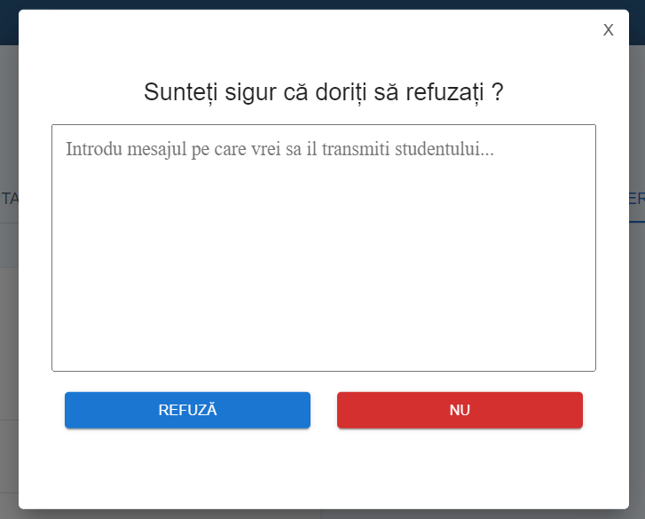

Dacă cererea a ajuns, în final, semnată de ambele părți, studentul va putea să descarce varianta  finală din cadrul tab-ului 3, altfel, va retrimite cererea până va fi acceptat.
Odată finalizat pasul acesta, procesul de colaborare se încheie cu succes. Tot ceea ce rămâne de făcut este ca studentul să țină legătura cu profesorul coordonator în vederea elaborării lucrării.
Însă, dacă studentul dorește să își schimbe titlul licenței după ce i s-a acceptat deja o cerere în perioada de înscriere, poate efectua acest lucru prin simpla generare și încărcare a noii cereri. La fel ca și anterior, modificarea poate fi atât acceptată, cât și refuzată. Cererea finală va rămâne întotdeauna cea mai recentă acceptată, indiferent câte vor fi transmise.

<h3>Pagină de admin și rapoarte</h3>

Din motive de securitate și siguranță, se vor afișa anumite detalii.
Această pagină este accesibilă la o cale diferită și cu un cont special, autorizat.

Un exemplu de pagină de rapoarte:
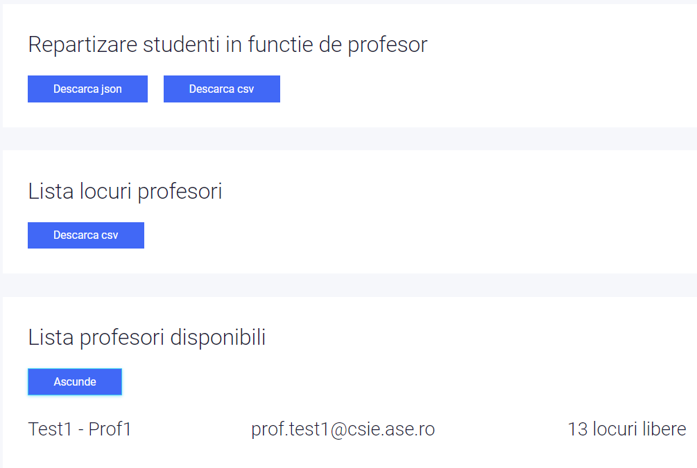

<b>Aplicația este încărcată pe serverul facultății. 
Baza de date utilizată este <i>MySQL</i></b>
